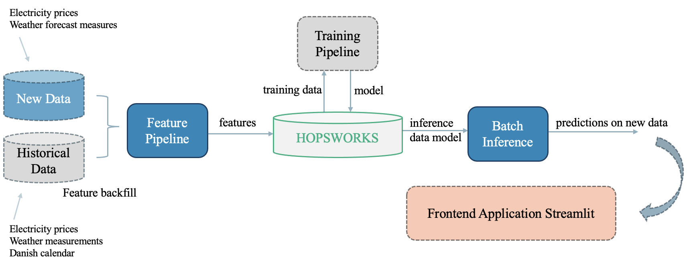

# **Msc. BDS Module - Data Engineering and Machine Learning Operations in Business (MLOPs)**   - Exam Assignment

# Topic Title: Electricity Price Predictor for Denmark DK1 

## Group 2 Members
| Name                     | Student ID |
|--------------------------|------------|
| Camilla Dyg Hannesbo     | 20202923   |
| Benjamin Ly              | 20205432   |
| Tobias Moesgård Jensen   | 20231658   |

## Business Problem
In recent times, energy prices have experienced a notable surge, prompting consumers and businesses alike to scrutinize their energy consumption patterns more closely than ever before. This surge in energy prices has not only heightened awareness regarding energy usage but has also sparked a renewed interest in identifying the optimal times for energy consumption. As consumers seek to navigate this landscape of rising energy costs, understanding when the best times are for utilizing energy becomes paramount. By pinpointing these optimal periods, individuals and organizations can strategically adjust their energy usage patterns to minimize costs while maximizing efficiency. ([Reference](https://www.sciencedirect.com/science/article/pii/S0306261919305380?casa_token=_hhzNcNsAigAAAAA:oG1cTP_L08OHxMEK3bByPppiE4EIYplXzdl5BEBxSZHgbxvN4KMbmRGW5RVIDmp2z-J9LjBIT3o))

### Objectives
The objective is to build a prediction system that predicts the daily electricity prices per hour in Denmark (area DK1) based on weather conditions, previous prices, and the Danish calendar. Each day the dataset will automatically update by using live API calls to the relevant data sources. This will end up in a frontend application there ultimately can help the user decide when is the best time to charge the electric vehicle or have production running. The application can be relevant for both individual clients and in a larger business perspective.

# Data Pipeline 
The prediction system is built using several features, training, and inference pipelines. [Hopsworks](https://www.hopsworks.ai) is used as the platform to store features in the **Hopworks Feature Store** and save the trained model in **Hopworks Model Registry**. The overall architecture of the Electricity Pipeline is illustrated below. Inspiration is taken from [MLOPs Lecture 2](https://github.com/saoter/SDS24_MLOps_L1/blob/main//MLOps_Lecture_2_slides.pdf).

## Feature Backfill
Implemented in [notebooks/1_feature_backfill.ipynb](https://github.com/Camillahannesbo/MLOPs-Assignment-/blob/main/notebooks/1_feature_backfill.ipynb). 

The notebook is divided into the following sections:
1. Loading historical data and process features
2. Connecting to Hopsworks Feature Store
3. Creating feature groups and uploading them to the feature store

**Data sources:**

Historical data on hourly electricity spot prices for area DK1 in DKK per day, sourced from [Energinet](https://www.energidataservice.dk), spans from January 1, 2022, until the present day, excluding today's data. 

Meteorological observations for Aalborg, Denmark, sourced from [Open Meteo](https://www.open-meteo.com), cover the same period, providing insights into weather conditions for Aalborg, Denmark. 

Additionally, a Danish calendar classifies dates into workdays (coded as 1) and non-workdays (coded as 0) from January 1, 2022, to December 31, 2024. The Danish holiday is taken from [Publicholidays](https://publicholidays.dk/da/2024-dates/) and the dataset is made manually by the group. 

See corresponding functions for data extraction in the folder [features](https://github.com/Camillahannesbo/MLOPs-Assignment-/tree/main/features). The functions include the initial API call and the following data preprocessing of the data.

**Feature groups:**

Creating feature groups for the three datasets defining a `primary_key` as `date` and `timestamp`, so the feature groups can be joined when creating a dataset for training in part `3_training_pipeline`. The feature groups are uploaded to the Feature Store that has been connected in Hopsworks.

## Feature Pipeline
Implemented in [notebooks/2_feature_pipeline.ipynb](https://github.com/Camillahannesbo/MLOPs-Assignment-/blob/main/notebooks/2_feature_pipeline.ipynb). 

The notebook is divided into the following sections:
1. Parsing new data of today of hourly electricity prices and forecast weather measurements.
2. Inserting the new data into the Feature Store.

The same API call is used for the electricity prices as in `1_feature_backfill`, just changing the historical setting to `false` so the fetched data is from real-time. To provide real-time weather measures, a weather forecast measure for the next 5 days is being fetched.

Uploading the new data to the feature groups created previously in `1_feature_backfill`.

## Training Pipeline
Implemented in [notebooks/3_training_pipeline.ipynb](https://github.com/Camillahannesbo/MLOPs-Assignment-/blob/main/notebooks/3_training_pipeline.ipynb). 

This notebook is divided into the following sections:
1. Feature selection.
2. Creating a Feature View.
3. Training datasets creation - splitting into train and test sets.
4. Training the model.
5. Register the model to the Hopsworks Model Registry.

**Feature selection:**

Initially, the features that should be included for model training were selected. The feature groups were joined together based on the specified `primary_keys` in `1_feature_backfill`. For `electricity_fg` and `danish_calendar_fg`, all columns are selected. However, for `weather_fg`, `timestamp`, `datetime`, and `hour` are not selected since these three features are already a part of the `electricity_fg`.

**Feature View:**

A Feature View was created based on the joined feature groups. A Feature View stores a metadata of our data. Having the Feature View a Training Dataset can further be created.

**Traning Dataset Creation:**

Creating the training/test split data was first retrieved from the Hopsworks Feature Store where the feature view was stored. The training data was then randomly split into 80% assigned to training and the remaining 20% was left out for testing and evaluating the model's performance. A `random_state` was set to ensure reproducibility.

**Traning Prediction Model:**

From the XGBoost Python Package, the XGBoost Regressor was initialized as the model used for training and testing. The model is fitted to the train data and further evaluated on test data using validation metrics from the sklearn library. 

| Validation metrics   | Value    |
|----------------------|----------|
| MSE                  | 0.059    |
| R^2                  | 0.933    |
| MAE                  | 0.166    |
 
The results are illustrated above and indicate that the model has a fairly good performance when it comes to predicting new electricity prices. It has relatively low error (both in terms of MSE and MAE), and a high percentage of the variance in the dependent variable is explained by the feature variables, as indicated by the high R-squared value.

Further, a plot showing the feature importance was created. Features like `temperature`, `day`, `hour`, and `month` are most important for predicting the dependent variable. 

**Register the model:**

A schema of the model's input and output is specified from training examples using the features (X_train) and dependent variable (y_train). An entry of the specified details is then created and the model is uploaded to the Hopsworks Model Registry.

## Batch Inference Pipeline
Implemented in [notebooks/4_batch_inference.ipynb](https://github.com/Camillahannesbo/MLOPs-Assignment-/blob/main/notebooks/4_batch_inference.ipynb).

This notebook is divided into the following sections:
1. Load new batch data.
2. Predict using the model from the Model Registry.

**Load new batch data:**

The objective is to predict the electricity prices for the upcoming days, therefore a weather forecast was loaded as batch data to generate predictions of the electricity price. This dataframe is merged with the calendar dataframe to obtain the same schema as the training data. This batch obtains daily weather measures forecast for the upcoming 5 days after the run (e.g., a run on May 7th will fetch values 5 days ahead including May 12th).

**Predicting of Electricity Prices:**

The saved XGBoost Regressor model was retrieved from Hopsworks and used on the new merged data to predict the electricity prices in the upcoming 5 days. 

Along with a prediction matrix on hourly intervals, the `4_batch_inference` pipeline also includes a time-series plot visualizing the trend of the spot price (in DKK) for DK1 over the prediction time. An interactive version of this in the form of a line chart with points and tooltips is also created enabling users to explore the data and gain insights interactively.

The feature pipeline and batch inference run daily as a scheduled function using Github Actions. 
A script is set up to run the feature and batch inference pipeline and a Github Action workflow is scheduled to run the script at 01:55 UTC everyday. Another workflow is scheduled to run at 02:01 UTC everyday to sync the Github Repository to Huggingface Spaces. 

# Future Work Considerations:

- Automatically calendar df to futureproof the project.
- Average weather data splitting Denmark into areas DK1 and DK2 and not only Aalborg.
- More pages in Streamlit App for implementing project considerations and methods into the application.
- Implement both DK1 and DK2 areas in the prediction system and Streamlit application.
- Maybe look into backtesting for splitting the dataset and not randomly splitting.
- Making an LLM model for more user-friendly interaction.
- Including tariffs and taxes to make the predictions more representable for the consumer.
